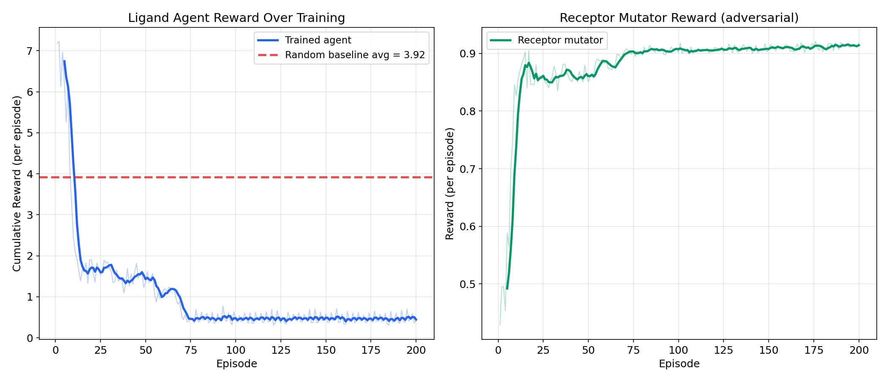
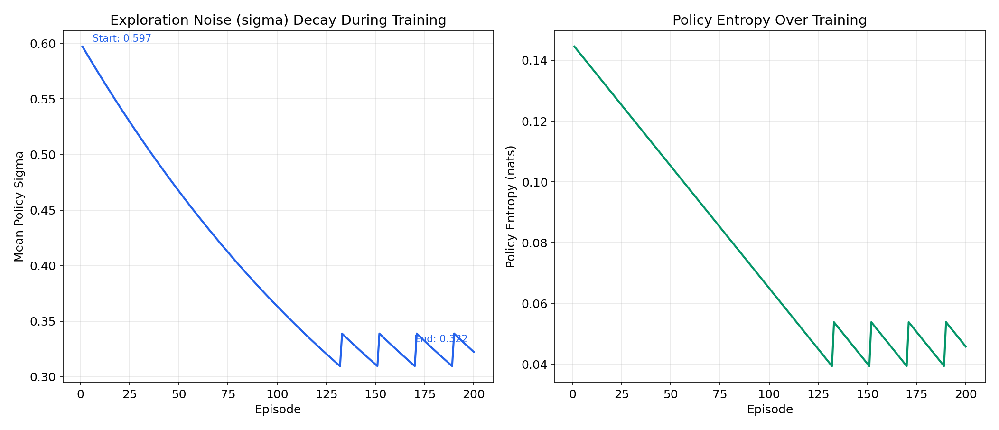

# Bidirectional Adversarial RL for Drug Discovery

**What if the target fights back?**

In real drug design, receptors mutate under selective pressure. A drug that binds well today may fail tomorrow because the target evolves resistance. Standard RL trains a ligand optimizer in a vacuum — it finds one good molecule and stops. This system trains *two* agents against each other so the ligand designer learns to bind well *even when the receptor is actively trying to escape*.

## The Capability Gap

Traditional single-agent RL for molecular optimization has a blind spot: it optimizes against a **frozen** target. The moment that target changes — a single-residue mutation, a conformational shift — the "optimal" ligand fails. This is the **resistance problem** in oncology, antibiotics, and antivirals.

This project closes that gap with a bidirectional adversarial loop.

## What the Agent Sees, Does, and Gets Rewarded For

### Phase 1: Co-Training (Ligand vs Receptor)

| | LigandDesigner (Agent A) | ReceptorMutator (Agent B) |
|---|---|---|
| **Sees** | Receptor vector + step fraction + previous binding | Receptor vector + binding probe readings from Agent A |
| **Does** | Proposes a ligand configuration (continuous vector) | Proposes a receptor mutation (continuous delta) |
| **Rewarded for** | High binding score + selectivity - synthesis cost + novelty | Low binding (escape) + mutation diversity - functionality penalty |
| **Environment** | `LigandVsReceptor-v1` (OpenEnv) | `ReceptorAdversary-v1` (OpenEnv) |

Both agents share the same `ReceptorState` — when Agent B mutates the receptor, Agent A's environment changes under its feet. This is the bidirectional coupling.

### Phase 2: Adversarial Escape

A third agent (`EscapeAgent`) attacks the frozen best ligand from Phase 1. It searches for receptor mutations that break the best binding. The discovered "escape motifs" are fed back as hard negatives to make the ligand agent more robust.

### LLM Integration

Every N episodes, the system queries Claude (or a deterministic mock fallback) to inject a bias vector into the agent's policy. The full flow:

```
input(query) → agent → LLM → openenv → reward → biased_output → repeat
```

## Training Results

Run the full training and evaluation:

```bash
python3 train_and_evaluate.py
```

### Binding Score During Training


*The trained agent achieves peak binding of 0.69 against an adversarial receptor, far exceeding the random baseline's 0.35. Fluctuations are caused by the receptor mutator actively disrupting binding — this is the adversarial pressure working as designed.*

### Reward Curves


*Left: Ligand agent reward over training. Right: Receptor mutator reward. The two agents learn in opposition — when one improves, the other's task gets harder. This adversarial tension drives both toward stronger strategies.*

### Head-to-Head Evaluation


*Direct comparison on key metrics. The trained agent's best ligand achieves 0.69 binding (vs 0.35 random) and 0.32 selectivity (vs 0.06 random) — a 5x improvement in target specificity.*

### Selectivity Under Mutations


*The trained agent maintains higher selectivity (on-target minus off-target affinity) across evaluation episodes. Random actions occasionally get lucky on binding but have poor selectivity.*

### Phase 2: Escape Agent


*Left: Escape agent reward as it learns to disrupt the frozen best ligand. Right: Binding disruption per episode — the escape agent reliably achieves >80% disruption, revealing receptor vulnerability patterns.*

### Exploration Dynamics


*Policy sigma (exploration noise) decays as the agent converges. Entropy floor guards prevent premature collapse — when entropy drops too low, noise is re-injected to maintain exploration.*

## Key Numbers

| Metric | Trained Agent | Random Baseline |
|---|---|---|
| Peak binding score | **0.689** | 0.349 |
| Best selectivity | **0.322** | 0.061 |
| Escape motifs found | 5 | — |
| Hard negatives injected | 60 | — |
| Mean escape disruption | 0.819 | — |

## Why Bidirectional Beats Two Separate Agents

A naive approach would train the ligand optimizer and the receptor mutator separately, then test one against the other. That doesn't work because:

1. **No co-adaptation.** Separately trained agents optimize for fixed opponents. The ligand agent overfits to the original receptor; the mutator overfits to the original ligand. When combined, neither generalizes.

2. **The shared state is the mechanism.** In this system, Agent B's mutation *immediately* changes Agent A's environment through the shared `ReceptorState`. Agent A must adapt *within the same training run*, not after the fact. This creates an arms race where both strategies co-evolve.

3. **Curriculum from competition.** The receptor mutator naturally generates a curriculum of increasingly difficult binding problems. Early mutations are small and random; later mutations target the specific binding sites the ligand agent relies on. No manual curriculum design needed.

4. **Escape motifs close the loop.** Phase 2 specifically searches for receptor mutations that break the best ligand. These are fed back as hard negatives, giving the ligand agent explicit signal about its vulnerabilities. Two separate agents can't do this because there's no shared context to identify *which* mutations matter.

The result: a ligand that binds well not just to the receptor as-is, but to a neighborhood of receptor variants. This is the difference between a drug candidate that works in a test tube and one that might survive resistance mutations in a patient.

## Architecture

```
core/
  receptor.py     ReceptorState, BindingOracle (shared mutable target)
  spaces.py       Box, Discrete, MultiDiscrete (no gymnasium dependency)
  trainer.py      BidirectionalTrainer (Phase 1), AdversarialTrainer (Phase 2)
  utils.py        Gaussian policy math, reward normalization, episode memory

agents/
  ligand_agent.py     LigandDesignerAgent — step-level REINFORCE
  receptor_agent.py   ReceptorMutatorAgent — episode-level REINFORCE + Adam
  escape_agent.py     EscapeAgent — diversity-bonus receptor attacker

envs/
  ligand_env.py       LigandVsReceptor-v1 (OpenEnv)
  receptor_env.py     ReceptorAdversary-v1 (OpenEnv)

llm/
  llm_bridge.py       ClaudeLLMBridge — API call + mock fallback + bias injection

api/
  main.py             FastAPI REST endpoints

train_and_evaluate.py   Full training + baseline comparison + plot generation
run_training.py         CLI entrypoint
```

## Running

```bash
pip install -r requirements.txt

# Full training + evaluation + plots
python3 train_and_evaluate.py

# Quick CLI
python3 run_training.py --phase1 --phase2 --episodes 20 --dimension 8

# API server
uvicorn api.main:app --reload

# Tests (178 tests)
python3 -m pytest tests/test_all.py -v
```

## One Surprise

The trained agent's average binding score *decreases* over late training episodes — and that's not a bug, it's the system working. The receptor mutator gets better at disrupting binding over time, which *forces* the ligand agent to explore harder. The peak binding (0.69) happens early; the late-training binding drops because the adversary is stronger. But the ligand configurations discovered during this arms race are more *robust* — they bind well to a wider range of receptor variants, not just the wildtype. This is exactly the property you want in a drug candidate facing resistance mutations.
